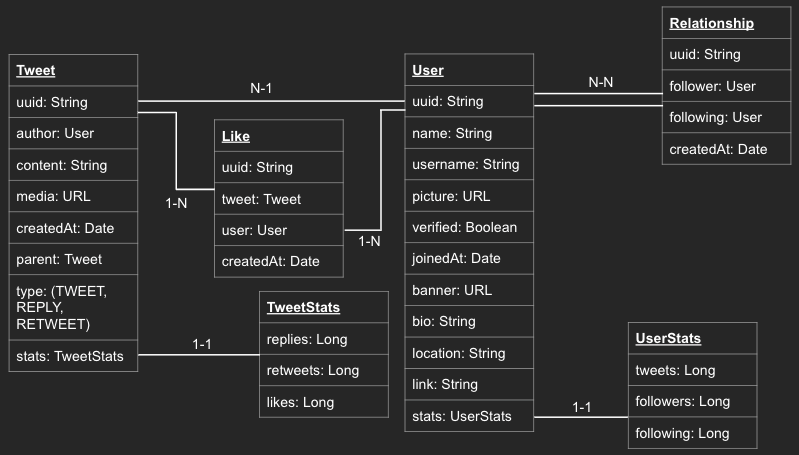

# HANDS-ON 2024

O Hands-on é um evento online para você aprender novas tecnologias, evoluir suas habilidades em programação e ainda concorrer a uma vaga na Hotmart!

### Programação

09h00 - Recepção e Café

09h30 - Abertura

10h55 - Palestra: Microsserviços com Spring Boot

12h30 - Almoço

14h00 - Hands-on! Desafio prático em duplas

18h40 - Encerramento

## Microsserviços com Spring Boot

Na Hotmart tecnologia é um dos nossos principais aliados, que nos move a levar nossos clientes a viverem de suas paixões. Com requisitos fortes como escalabilidade, resiliência a falhas, performance e outros mais, precisamos estar sempre antenados e usando o que há de melhor no mercado. Neste Hands-on vamos ver na prática como estes requisitos são fortemente atendidos usando microsserviços com Spring Boot.

### Palestrante: Fábio Viana

Fábio Viana é referência em Arquitetura de Sistemas, Cloud e Java. Atua na área de desenvolvimento há mais de 20 anos e há 7 é Trooper da Hotmart, atuando como Principal Software Engineer of Cloud & Security.

## Desafios

O projeto é uma simulação da rede social Twitter, com algumas de suas funcionalidades. O objetivo é demonstrar de maneira prática como criar microsserviços responsivos, resilientes e elásticos.

A imagem abaixo mostra o modelo de dados utilizado pela aplicação. Utilize este modelo como referência para executar os desafios:



### #1 - Bugfix: corrigir um erro na ação "unfollow"
Um bug foi identificado na ação de deixar de seguir um usuário (unfollow).

- Identifique qual é o bug e faça a correção
- Utilize o teste RelationshipControllerTest.unfollowWithValidUsersShouldReturnOk

### #2 - Feature: implementar a ação "dislike"
Um usuário deve ser capaz de desfazer o like em algum tweet. Após desfazer a ação, é necessário que o contador de likes do tweet seja atualizado.

- Identifiquei o local correto para a implementação desta ação
- Utilize o teste LikeControllerTest.dislikeWithValidUserAndTweetShouldReturnOk

### #3 - Feature: implementar ação "reply" de um tweet
Um usuário deve ser capaz de responder um tweet. Esta ação deve atualizar a quantidade de respostas (reply) do tweet resppondido.

- Identifique o local correto para a implementação desta ação
- Será necessário criar outro registro de tweet, com seu devido type=REPLY
- Utilize o teste TweetControllerTest.createWithValidRequestAndParentTweetShouldReturnCreated

### #4 - Feature: implementar o retweet
Um usuário deve ser capaz de postar um tweet de outra pessoa em sua linha do tempo (timeline). Isto quer dizer que o tweet original é copiado para a linha do tempo do usuário que criou o retweet.

- Identifique o local correto para a implementação desta ação
- Será necessário criar outro registro de Tweet, com seu devido type=RETWEET
- Utilize o teste TweetControllerTest.retweetWithValidUserAndTweetShouldReturnCreated

### Bonus
Que tal construir novas funcionalidades que envolvam o front-end e back-end, ponta a ponta, como por exemplo a tela de Perfil do usuário. Você também pode melhorar a cobertura de testes do projeto. Você encontrará exemplos no código de testes unitários e de integração prontos que servem de referência, mas que não estão compreendendo todas as possibilidades testáveis.

## Informações Úteis

### Swagger
A URL para visualizar a documentação da API é ```<HOST>/swagger-ui.html```, onde o ```HOST``` será informado pelo monitor. Abaixo um exemplo:

http://localhost:8080/swagger-ui.html

### Aplicação
A URL para visualizar a aplicação é ```<HOST>/timeline/<USER>```, onde o ```HOST``` será informado pelo monitor e o ```USER``` é o perfil desejado. Abaixo alguns exemplos:

- http://localhost:8080/timeline/user1
- http://localhost:8080/timeline/hotmart
- http://localhost:8080/timeline/sparkle

### MongoDB
O MongoDB está rodando integrado ao projeto (embeeded), assim, no start da app uma instância do mongodb rodará junto à aplicação.

## Boa sorte!